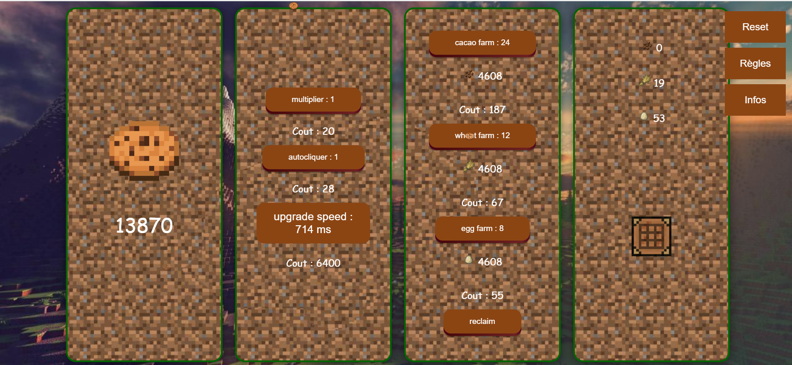

# Cookie Clicker Minecraft

## Description
Ce projet est une version personnalisée du célèbre jeu Cookie Clicker, avec un thème Minecraft. Le but du jeu est de cliquer sur un cookie pour gagner des points et acheter des améliorations qui augmentent votre production de points.



## Fonctionnalités
- **Clique sur le cookie** : Cliquez sur le cookie pour gagner des points.
- **Améliorations** : Utilisez vos points pour acheter des améliorations telles que des multiplicateurs, des autoclickers, et des fermes (cacao, blé, œuf) pour augmenter votre production de points.
- **Autoclicker** : L'autoclicker clique automatiquement sur le cookie pour vous à intervalles réguliers. Vous pouvez améliorer la vitesse de l'autoclicker.
- **Fermes** : Les fermes produisent des ressources automatiquement. Vous pouvez acheter des fermes de cacao, de blé et d'œufs.
- **Récolte** : Cliquez sur le bouton "reclaim" pour collecter les ressources produites par les fermes.
- **Craft** : Utilisez les ressources collectées pour crafter et gagner des points supplémentaires.
- **Sauvegarde automatique** : Le jeu sauvegarde automatiquement votre progression dans le localStorage.
- **Réinitialisation** : Cliquez sur le bouton "Reset" pour réinitialiser votre progression.

## Installation
1. Clonez le dépôt :
    ```bash
    git clone <URL_DU_DEPOT>
    ```
2. Ouvrez le fichier `index.html` dans votre navigateur.

## Utilisation
- Cliquez sur le cookie pour gagner des points.
- Utilisez les points pour acheter des améliorations.
- Les fermes produisent des ressources automatiquement.
- Cliquez sur le bouton "reclaim" pour collecter les ressources produites par les fermes.
- Utilisez les ressources collectées pour crafter et gagner des points supplémentaires.

## Fichiers
- `index.html` : Contient la structure HTML du jeu.
- `style.css` : Contient les styles CSS pour le jeu.
- `script2.js` : Contient la logique JavaScript du jeu.

## Dépendances
- Aucune dépendance externe n'est requise pour ce projet.

## Auteur
- Enzo R.